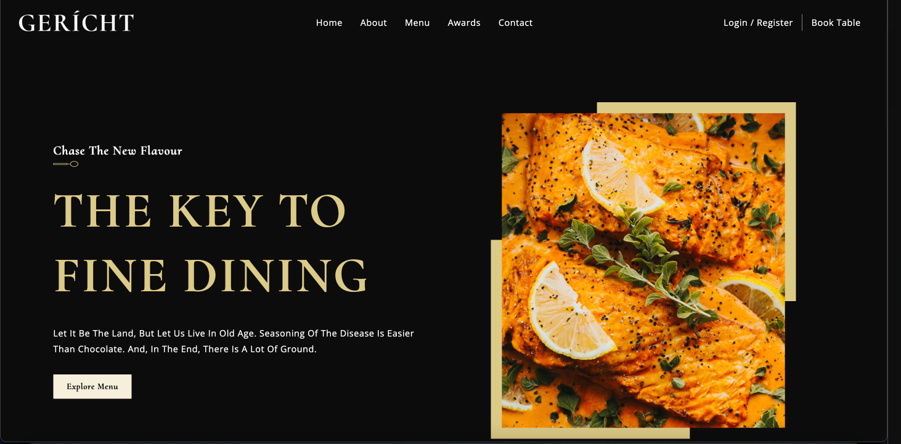

## Projeto Gerícht 🧑🏼‍🍳🍴

----
---
📝 Proposta: Um site harmonioso, responsivo e com um design super elegante de um restaurante. A aplicação foi feita em React combinada com CSS moderno e JavaScript.

----
#### Navegue aqui 🧑🏼‍🍳 [Gerícht](https://gericht-restaurant-vn.netlify.app//) ✅
----

### 💡 Conhecimentos aplicados:
- HTML
- CSS
- React
- JavaScript 
- Responsividade 📱
- Hooks
- Componentes funcionais em React
---
### 🔗 Linkedin [@vitornogueira](https://www.linkedin.com/in/vitor-noqueira-dev/) ✅
---
